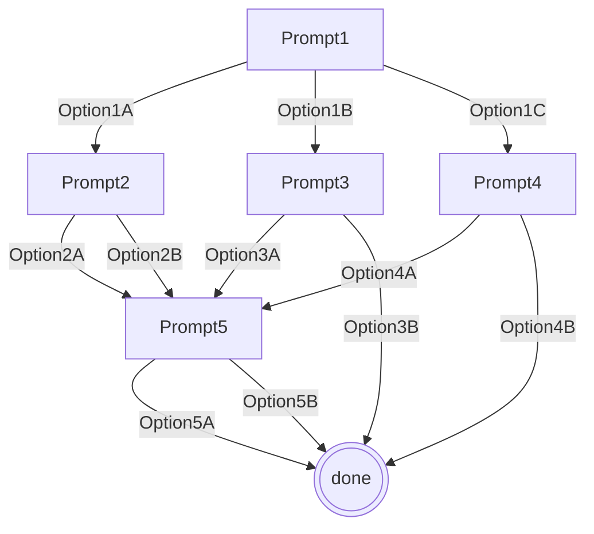

import { Callout } from "nextra/components";

# Polls

A poll is assigned to one location, and it has many prompts, each with many options.
Each option has a `nextPromptId` that sets the next poll item when clicked.
At this time, we only support one option to be selected by a user per prompt.
When a poll is located on a webinar, each prompt needs a `videoOffsetSeconds`.
When the next prompt is decided (as either the first prompt of the poll or following an option click), the prompt is only displayed if the `videoOffsetSeconds` has passed.

### One active poll per location

A poll cannot be used in multiple locations, a prompt cannot be used in multiple polls, and an option cannot be used in multiple prompts.

### When an option is selected

If a prompt is displayed and an option is not chosen, the prompt will not change. When an option is selected, the selected option will be displayed for 5 seconds before the component is hidden.
If there is no next prompt, nothing happens. If the next prompt has a `videoOffsetSeconds` later than the current timestamp of the webinar, it will stay hidden until that timestamp is reached. If the time has already passed, that next prompt is displayed after that 5 seconds.

## Creating a Poll

- A name, brand, and one prompt are required to save a newly created poll.
- A poll can be created and saved without being assigned to a location.
- A poll can be revisited and edited as much as you want, until it is published or archived.

## Explanation of Publication

In order for users to see and vote on a poll, it must be published. When a poll is published or archived, it is no longer editable.
Any poll (even those that are published or archived) can be duplicated. Then you can edit the new copy.
Duplication keeps all text fields and options, but not created at, published at, archived at, nextPromptIds of the options, or ids of the originals.

## Requirements for Publication

- Brand, name, valid location assignment
- One prompt must be marked as first
- At least one prompt, each prompt must have at least two options
- The location it is assigned to must not have any other published polls assigned to it -- that old poll will be archived first.
- If the poll is on a webinar, all prompts for a poll on a webinar must have a video offset
- A poll can have an unlimited amount of prompts and options, but must have at least two prompts, and each prompt must have at least two options

## Poll Location Assignment

- A poll must be assigned to a location to be published. Current location options are lessons and webinars.
- A location can only have one published+unarchived poll assigned to it at a time. This is the location's "active" poll.
- If another poll is active on the location you want to assign a different poll to, that old poll must be archived first.
