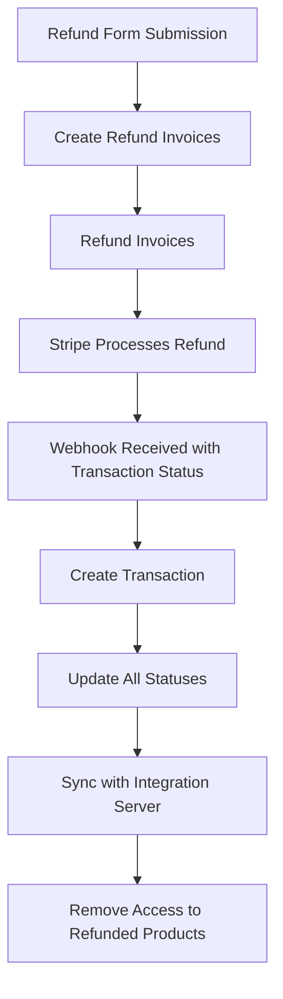

# Refunds: How to Process Refunds for User Purchases

## One-time Payment Refund

1. Navigate to the [User Dashboard](https://prd-xms-api.combinedcuriosity.io/admin/users/).
2. Locate the user you want to refund and find the corresponding order.
3. Click the `Refund` icon next to the offer you wish to refund.
4. Provide a reason for the refund and click `Refund Item`.

#### Resulting Statuses

| Payment Object               | Status         | 
| ---------------------------- | -------------- | 
| Order                        | refunded       | 
| Refunded Order Line Item     | refunded       |
| Shipping Order Line Item     | paid           |
| Original Invoice             | paid           | 
| Refund Invoice                | paid           | 

## Payment Plan Refund

1. Navigate to the [User Dashboard](https://prd-xms-api.combinedcuriosity.io/admin/users/).
2. Find the user and the corresponding order.
3. Click the `Refund` icon next to the offer you want to refund.
4. Provide a reason for the refund and click `Refund Item`.

#### Resulting Statuses

| Payment Object               | Status         | 
| ---------------------------- | -------------- | 
| Order                        | refunded       | 
| Refunded Order Line Item     | refunded       |
| Shipping Order Line Item     | paid           |
| Original Invoice             | paid           | 
| Refund Invoice                | paid           | 
| Future Invoices              | cancelled      |

## Partial Refund

### One-time Payment Partial Refund

1. Navigate to the [User Dashboard](https://prd-xms-api.combinedcuriosity.io/admin/users/).
2. Locate the user and the order you want to refund.
3. Click the `Refund` icon next to the offer.
4. Click the edit icon next to the Refund Amount field.
5. Enter the amount to refund.
6. Provide a reason for the refund and click `Refund Item`.

#### Resulting Statuses

| Payment Object               | Status               | 
| ---------------------------- | -------------------- | 
| Order                        | partially_refunded  | 
| Refunded Order Line Item     | partially_refunded  |
| Shipping Order Line Item     | paid                 |
| Original Invoice             | paid                 | 
| Refund Invoice                | paid                 | 

### Payment Plan Adjustment

1. Navigate to the [User Dashboard](https://prd-xms-api.combinedcuriosity.io/admin/users/).
2. Find the user and the order you want to adjust.
3. Click the `Edit` button at the top right corner.
4. Enter the new expected value.
5. Reconcile the difference in the `Refund Amount` field with future invoices.
6. Once accounted for, click `Submit Adjustments`.

#### Resulting Statuses

| Payment Object               | Status         | 
| ---------------------------- | -------------- | 
| Order                        | paying         | 
| Adjusted Order Line Item     | paying         |
| Shipping Order Line Item     | paid           |
| Original Invoice             | paid           | 
| Future Invoices              | future         |

**Note:** The expected amount is now the original amount minus the adjustment.

## Refund Process Overview

This diagram illustrates the high-level flow of the refund process from form submission to syncing with the integration server and removing access to refunded products.