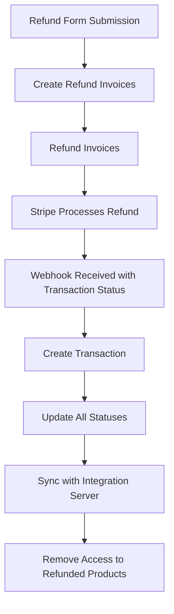

import { Tabs } from "nextra/components"
import Logo from "../../components/logo"

# Refunds

<Logo />

## How to refund a users purchase

<Tabs items={["One time payment", "Payment plan"]}>
  <Tabs.Tab>This is how you refund a one time payment</Tabs.Tab>
  <Tabs.Tab>This is how you refund a payment plan</Tabs.Tab>
</Tabs>

## How to give a partial refund

<Tabs items={["One time payment", "Payment plan"]}>
  <Tabs.Tab>This is how you give a partial refund for a one time payment</Tabs.Tab>
  <Tabs.Tab>This is how you give a partial refund for a payment plan</Tabs.Tab>
</Tabs>

## What the refund process looks like

### Final Result

Order Status: Refunded