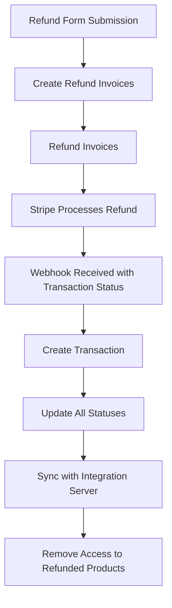

import { Steps } from "nextra/components"

# Refunds: How to Process Refunds for User Purchases

## Refund

### One-time Payment Refund

<Steps>
### Navigate to the [User Dashboard](https://prd-xms-api.combinedcuriosity.io/admin/users/).
### Locate the user you want to refund and find the corresponding order.
### Click the `Refund` icon next to the offer you wish to refund.
The refund icon is a blue box with a left pointing arrow.
### Provide a reason for the refund and click `Refund Item`.
</Steps>

_A successful refund is indicated by a green confirmation message appearing at the top, confirming that the refund amount has been successfully processed._

#### Resulting Statuses

| Payment Object               | Status         | 
| ---------------------------- | -------------- | 
| Order                        | refunded       | 
| Refunded Order Line Item     | refunded       |
| Shipping Order Line Item     | paid           |
| Original Invoice             | paid           | 
| Refund Invoice               | paid           | 

### Payment Plan Refund

<Steps>
### Navigate to the [User Dashboard](https://prd-xms-api.combinedcuriosity.io/admin/users/).
### Find the user and the corresponding order.
### Click the `Refund` icon next to the offer you want to refund.
The refund icon is a blue box with a left pointing arrow.
### Provide a reason for the refund and click `Refund Item`.
</Steps>

_A successful refund is indicated by a green confirmation message appearing at the top, confirming that the refund amount has been successfully processed._

#### Resulting Statuses

| Payment Object               | Status         | 
| ---------------------------- | -------------- | 
| Order                        | refunded       | 
| Refunded Order Line Item     | refunded       |
| Shipping Order Line Item     | paid           |
| Original Invoice             | paid           | 
| Refund Invoice               | paid           | 
| Future Invoices              | cancelled      |

## Partial Refund

### One-time Payment Partial Refund

<Steps>
### Navigate to the [User Dashboard](https://prd-xms-api.combinedcuriosity.io/admin/users/).
### Locate the user and the order you want to refund.
### Click the `Refund` icon next to the offer.
The refund icon is a blue box with a left pointing arrow.
### Click the edit icon next to the Refund Amount field.
### Enter the amount to refund.
For example, if the customer paid $10.00 for an item that was later seen in an email priced at $8.00, enter the refund amount as $2.00.
### Provide a reason for the refund and click `Refund Item`.
</Steps>

_A successful partial refund is indicated by a green confirmation message appearing at the top, confirming that the refund amount has been successfully processed._

#### Resulting Statuses

| Payment Object               | Status               | 
| ---------------------------- | -------------------- | 
| Order                        | partially_refunded   | 
| Refunded Order Line Item     | partially_refunded   |
| Shipping Order Line Item     | paid                 |
| Original Invoice             | paid                 | 
| Refund Invoice               | paid                 | 

### Payment Plan Adjustment

<Steps>
### Navigate to the [User Dashboard](https://prd-xms-api.combinedcuriosity.io/admin/users/).
### Find the user and the order you want to adjust.
### Click the `Edit` button at the top right corner.
### Enter the new expected value.
### Reconcile the difference in the `Refund Amount` field with future invoices.
### Once accounted for, click `Submit Adjustments`.
</Steps>

#### Resulting Statuses

| Payment Object               | Status         | 
| ---------------------------- | -------------- | 
| Order                        | paying         | 
| Adjusted Order Line Item     | paying         |
| Shipping Order Line Item     | paid           |
| Original Invoice             | paid           | 
| Future Invoices              | future         |

**Note:** The expected amount is now the original amount minus the adjustment.

## Refund Process Overview [#value-in-meaning]

This diagram illustrates the high-level flow of the refund process from form submission to syncing with the integration server and removing access to refunded products.