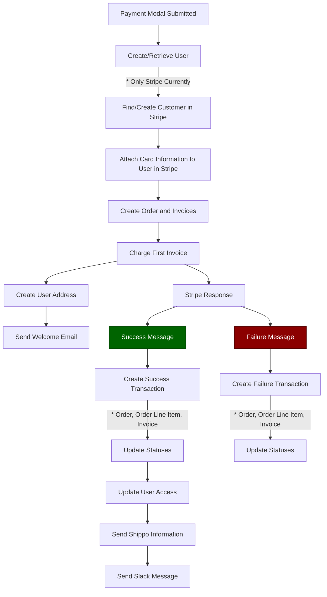

import { Steps } from "nextra/components"

# Taking Payments

## How to get the embed code for the payment modal [#embed-code]

<Steps>
  ### Navigate to the [Brand Dashboard](https://prd-xms-api.combinedcuriosity.io/admin/brands/).
  ### Select the brand you want to get the embed code for.
  ### Click the offers tab.
  ### Find the offer you want to embed and click the chevron icon.
  The chevron icon is two arrows pointing outwards.
  ### Enter the css selector for th element you want to trigger the embed code.
  ### Select the shipping offer
  ### Click anywhere in the gray box to copy the embed code.
  ### Paste the code where desired
</Steps>

## How to get the purchase link for the payment modal [#purchase-link]

<Steps>
  ### Navigate to the [Brand Dashboard](https://prd-xms-api.combinedcuriosity.io/admin/brands/).
  ### Select the brand you want to get the purchase link for.
  ### Click the offers tab.
  ### Next to the Offers title, click the take my money icon.
  The take my money icon is a hand holding cash.
  ### Select one or many offers to purchase.
  ### Select the shipping offer if for an international customer.
  ### Click anywhere in the gray box to copy the purchase link.
  ### Paste the link where desired
</Steps>

## How to payoff a payment plan [#pp-payoff]

<Steps>
  ### Navigate to the [User Dashboard](https://prd-xms-api.combinedcuriosity.io/admin/users/).
  ### Locate the user who wants to pay off their payment plan.
  ### Click the take my money icon next to the order they want to pay off.
  ### Confirm that they want to payoff the payment plan.
</Steps>

_A successful payoff will be confirmed by a green message displayed at the top._

#### Resulting Statuses

| Payment Object            | Status   |
| ------------------------- | -------- |
| Order                     | paid     |
| Order Line Item           | paid     |
| Shipping Order Line Item  | paid     |
| Original Invoice          | paid     |
| Payoff Invoice            | paid     |
| Future Invoices           | canceled |

## What the payment process looks like [#value-in-meaning]

_This diagram illustrates the high-level flow of the payment process._

