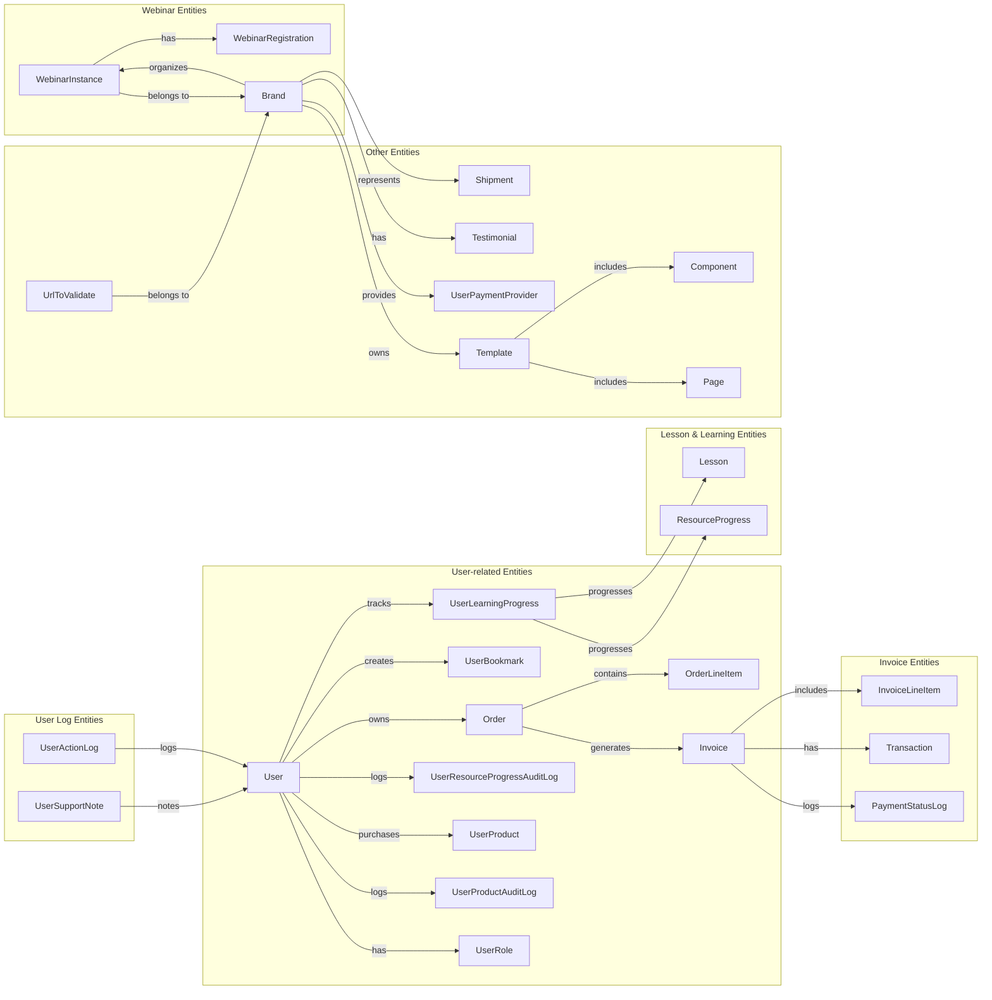
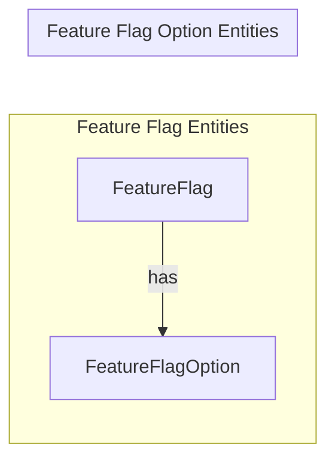
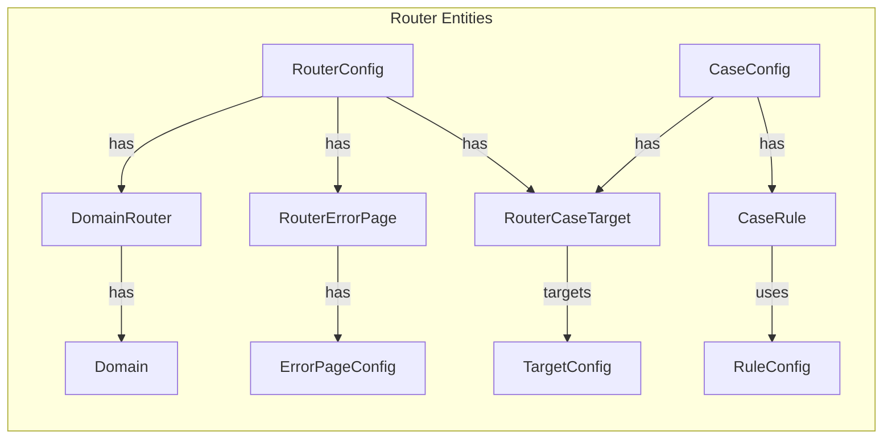
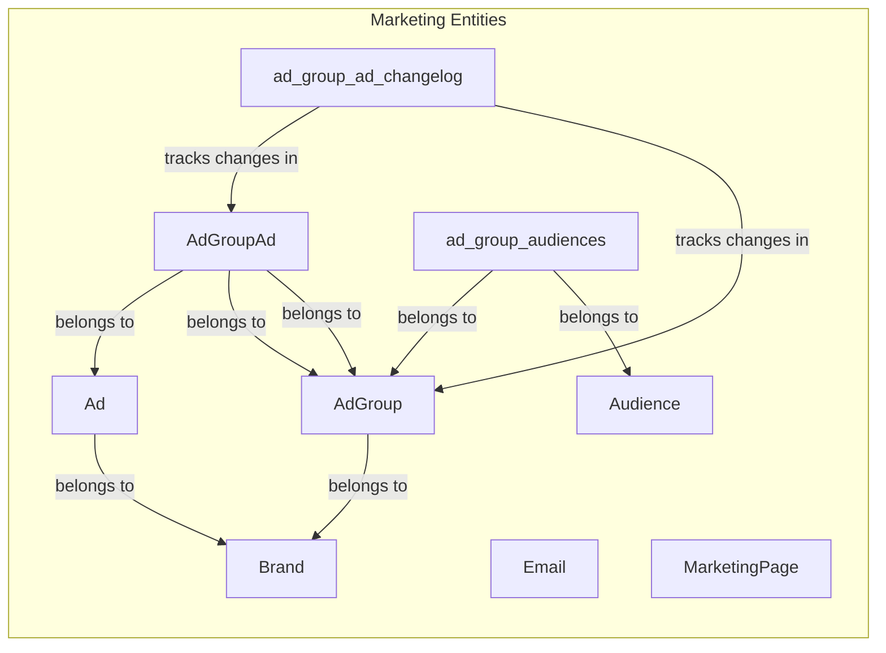
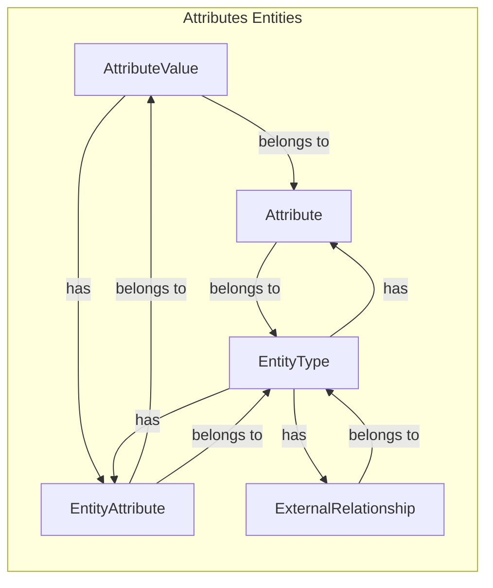
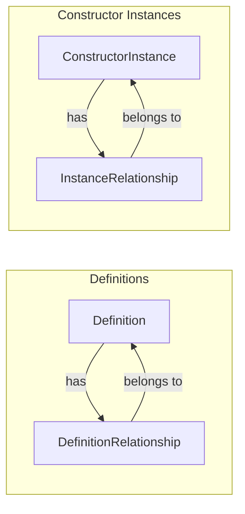
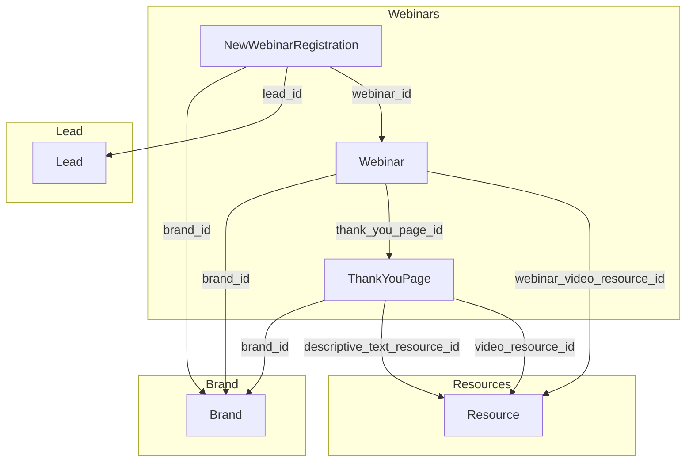

# Data Visualization

## Public Schema

```mermaid
graph LR

    subgraph "User-related Entities"
        User
        Order
        OrderLineItem
        Invoice
        UserBookmark
        UserLearningProgress
        UserResourceProgressAuditLog
        UserProduct
        UserProductAuditLog
        UserRole

        User -->|owns| Order
        Order -->|contains| OrderLineItem
        Order -->|generates| Invoice
        User -->|creates| UserBookmark
        User -->|tracks| UserLearningProgress
        User -->|logs| UserResourceProgressAuditLog
        User -->|purchases| UserProduct
        User -->|logs| UserProductAuditLog
        User -->|has| UserRole
    end

    subgraph "Lesson & Learning Entities"
        Lesson
        ResourceProgress

        UserLearningProgress -->|progresses| Lesson
        UserLearningProgress -->|progresses| ResourceProgress
    end

    subgraph "Webinar Entities"
        WebinarInstance
        WebinarRegistration
        Brand

        WebinarInstance -->|has| WebinarRegistration
        WebinarInstance -->|"belongs to"| Brand
    end

    subgraph "Invoice Entities"
        Invoice
        InvoiceLineItem
        Transaction
        PaymentStatusLog

        Invoice -->|includes| InvoiceLineItem
        Invoice -->|has| Transaction
        Invoice -->|logs| PaymentStatusLog
    end

    subgraph "User Log Entities"
        UserSupportNote
        UserActionLog
        User

        UserSupportNote -->|notes| User
        UserActionLog -->|logs| User
    end

    subgraph "Other Entities"
        UrlToValidate
        Brand
        Shipment
        Testimonial
        UserPaymentProvider
        Template
        Component
        Page

        UrlToValidate -->|"belongs to"| Brand
        Brand -->|represents| Shipment
        Brand -->|organizes| WebinarInstance
        Brand -->|has| Testimonial
        Brand -->|provides| UserPaymentProvider

        Brand -->|owns| Template
        Template -->|includes| Component
        Template -->|includes| Page
    end

```

## Experiments Schema

```mermaid
graph LR

    subgraph "Feature Flag Entities"
        FeatureFlag
        FeatureFlagOption

        FeatureFlag -->|has| FeatureFlagOption
    end

    subgraph "Feature Flag Option Entities"
        FeatureFlagOption
    end
```

## Router Schema

```mermaid
graph LR

    subgraph "Router Entities"
        CaseConfig
        CaseRule
        DomainRouter
        Domain
        ErrorPageConfig
        RouterCaseTarget
        RouterConfig
        RouterErrorPage
        RuleConfig
        TargetConfig

        CaseConfig -->|has| CaseRule
        CaseConfig -->|has| RouterCaseTarget
        DomainRouter -->|has| Domain
        RouterConfig -->|has| DomainRouter
        RouterConfig -->|has| RouterCaseTarget
        RouterConfig -->|has| RouterErrorPage
        RouterErrorPage -->|has| ErrorPageConfig
        RouterCaseTarget -->|targets| TargetConfig
        CaseRule -->|uses| RuleConfig
    end
```

## Marketing Schema

```mermaid
graph LR

    subgraph "Marketing Entities"
        AdGroupAd
        AdGroup
        Ad
        Audience
        Email
        MarketingPage
        ad_group_ad_changelog
        ad_group_audiences

        AdGroupAd -->|belongs to| Ad
        AdGroupAd -->|belongs to| AdGroup
        AdGroup -->|belongs to| Brand
        Ad -->|belongs to| Brand
        AdGroupAd -->|belongs to| AdGroup
        ad_group_ad_changelog -->|tracks changes in| AdGroupAd
        ad_group_ad_changelog -->|tracks changes in| AdGroup
        ad_group_audiences -->|belongs to| AdGroup
        ad_group_audiences -->|belongs to| Audience
    end
```

## Attributes Schema

```mermaid
graph LR

    subgraph "Attributes Entities"
        AttributeValue
        Attribute
        ExternalRelationship
        EntityType
        EntityAttribute

        AttributeValue -->|belongs to| Attribute
        AttributeValue -->|has| EntityAttribute
        Attribute -->|belongs to| EntityType
        EntityType -->|has| Attribute
        EntityType -->|has| EntityAttribute
        EntityType -->|has| ExternalRelationship
        ExternalRelationship -->|belongs to| EntityType
        EntityAttribute -->|belongs to| AttributeValue
        EntityAttribute -->|belongs to| EntityType
    end
```

## Constructors Schema

```mermaid
graph LR

    subgraph "Definitions"
        Definition
        DefinitionRelationship

        Definition -->|has| DefinitionRelationship
        DefinitionRelationship -->|belongs to| Definition
    end

    subgraph "Constructor Instances"
        ConstructorInstance
        InstanceRelationship

        ConstructorInstance -->|has| InstanceRelationship
        InstanceRelationship -->|belongs to| ConstructorInstance
    end
```

## Webinar Schema

```mermaid
graph TD;

  subgraph Webinars
    A[Webinar]
    B[ThankYouPage]
    C[NewWebinarRegistration]
  end;

  subgraph Resources
    D[Resource]
  end;

  subgraph Brand
    E[Brand]
  end;

  subgraph Lead
    F[Lead]
  end;

  A -->|brand_id| E;
  A -->|thank_you_page_id| B;
  A -->|webinar_video_resource_id| D;
  B -->|brand_id| E;
  B -->|descriptive_text_resource_id| D;
  B -->|video_resource_id| D;
  C -->|brand_id| E;
  C -->|lead_id| F;
  C -->|webinar_id| A;
```